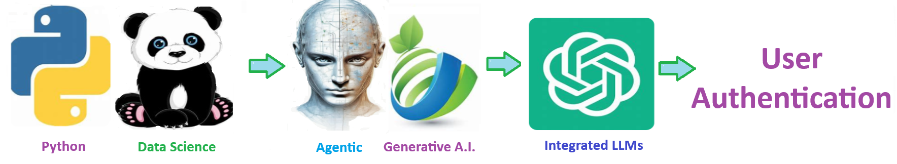
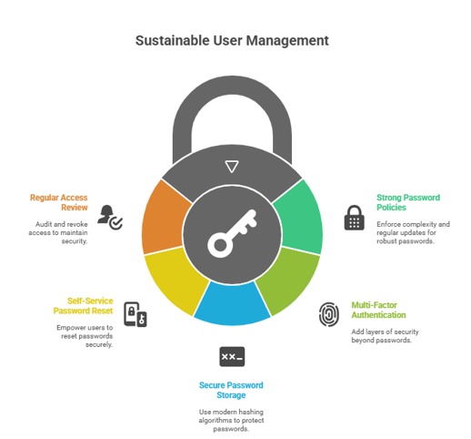

    
# Authentication 

## User and password authentication

    

    

## 🧠 Authentication is the process of verifying a user’s identity before granting access to a system.

### 5 sustainable practices for managing users and their passwords:

1. **Use strong password policies** – require minimum length, complexity (letters, numbers, symbols), and regular updates.

2. **Implement multi-factor authentication (MFA)** – add an extra layer beyond passwords, such as codes, biometrics, or tokens.

3. **Store passwords securely** – always hash and salt passwords with modern algorithms (e.g., bcrypt, Argon2) instead of storing them in plain text.

4. **Enable self-service password resets** – let users securely reset passwords through email/phone verification to reduce admin workload.

5. **Review and revoke access regularly** – remove inactive accounts and audit user roles/permissions to ensure least-privilege access.

Welcome to the solution **Authentication** - an example for your projects

User and password authentication

 
## 🧠 Authentication is the process of verifying a user’s identity before granting access to a system.

### 5 sustainable practices for managing users and their passwords:

1. **Use strong password policies** – require minimum length, complexity (letters, numbers, symbols), and regular updates.

2. **Implement multi-factor authentication (MFA)** – add an extra layer beyond passwords, such as codes, biometrics, or tokens.

3. **Store passwords securely** – always hash and salt passwords with modern algorithms (e.g., bcrypt, Argon2) instead of storing them in plain text.

4. **Enable self-service password resets** – let users securely reset passwords through email/phone verification to reduce admin workload.

5. **Review and revoke access regularly** – remove inactive accounts and audit user roles/permissions to ensure least-privilege access.

 

    

    
## Getting Started

The goal of this solution is to **Jump Start** your development and have you up and running in 30 minutes. 

To get started with the **Authentication** solution repository, follow these steps:
1. Clone the repository to your local machine.
2. Install the required dependencies listed at the top of the notebook.
3. Explore the example code provided in the repository and experiment.
4. Run the notebook and make it your own - **EASY !**
    
## 🧠 Solution Features

- ✅ Easy to understand and use  
- ✅ Easily Configurable 
- ✅ Quickly start your project with pre-built templates
- ✅ Its Fast and Automated
- ✅ Saves You Time 

## ⚙️ Key Features

- ✅ **Self Documenting** Automatically identifies and annotates major steps in a notebook, making the codebase readable and well structured.
- ✅ **Self Testing** Includes built in **unit tests** for each function to validate logic and ensure code reliability.
- ✅ **Easily Configurable** Uses a simple **config.ini** file for centralized settings and easy customization through key value pairs.
- ✅ **Talking Code** explains itself through inline commentary, helping you understand both **what** it does and **why** it does it.
- ✅ **Self Logging** extends Python’s standard **logging** module for **step by step runtime insights**.
- ✅ **Self Debugging** Includes debugging hooks and detailed error tracing to simplify development and troubleshooting.
- ✅ **Low Code or  No Code** Designed to minimize complexity — most full solutions are under 50 lines of code.
- ✅ **Educational** Each template includes educational narrative and background context to support learning, teaching, and collaborative development.

    