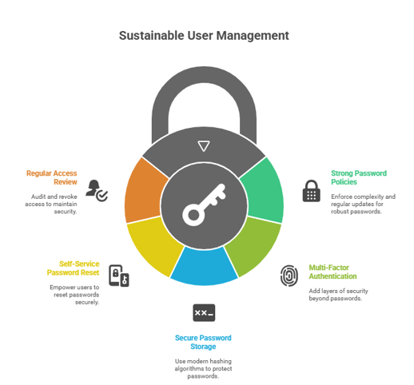

## 🧠 Authentication is the process of verifying a user’s identity before granting access to a system.

### 5 sustainable practices for managing users and their passwords:

1. **Use strong password policies** – require minimum length, complexity (letters, numbers, symbols), and regular updates.

2. **Implement multi-factor authentication (MFA)** – add an extra layer beyond passwords, such as codes, biometrics, or tokens.

3. **Store passwords securely** – always hash and salt passwords with modern algorithms (e.g., bcrypt, Argon2) instead of storing them in plain text.

4. **Enable self-service password resets** – let users securely reset passwords through email/phone verification to reduce admin workload.

5. **Review and revoke access regularly** – remove inactive accounts and audit user roles/permissions to ensure least-privilege access.

